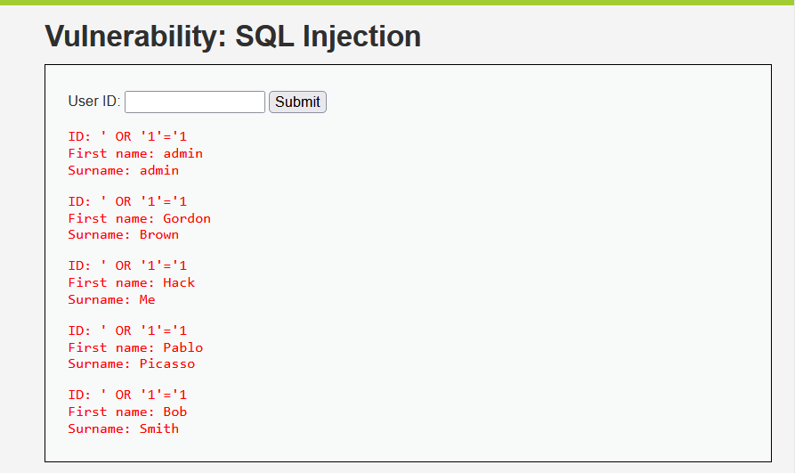

# Vulnerabilidad 1: Inyección SQL

## Evidencia y Payload
El ataque se realizó en DVWA usando el siguiente payload:
`' OR '1'='1`

## Por qué funciona
La aplicación construye la consulta concatenando la entrada del usuario directamente sin sanitizar. La comilla simple insertada cierra el dato original y la expresión añade una condición siempre verdadera.

## CVSS y Prevención
* **Puntaje CVSS 3.1:** 7.5 (Alto)
* **Defensa:** Implementar consultas parametrizadas para que el motor trate la entrada como un valor literal y no como código.