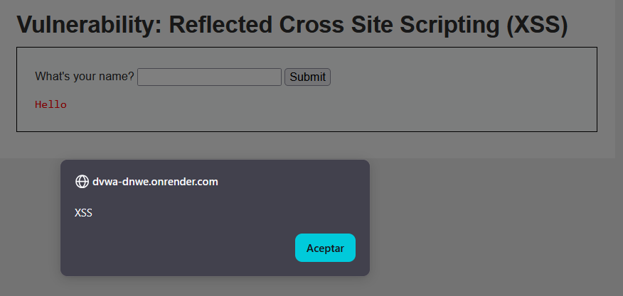

# Vulnerabilidad 2: XSS Reflejado

## Evidencia y Payload
El ataque se realizó inyectando el siguiente script:
``

## Por qué funciona
La vulnerabilidad ocurre porque la aplicación devuelve el texto introducido por el usuario sin procesarlo, haciendo que el navegador lo ejecute como código.

## CVSS, Prevención y Mitigación
* **Puntaje CVSS 3.1:** 6.1 (Medio)
* **Defensa:** Escapar la salida convirtiendo caracteres especiales (por ej. `<` en `&lt;`) y establecer una Content Security Policy (CSP).
* **Mitigación (OWASP):** Acorde al marco de referencia OWASP, se debe configurar una estricta política de CSP en las cabeceras HTTP del servidor. Esto mitigará el ataque bloqueando la ejecución de cualquier script que no provenga de una fuente autorizada.
