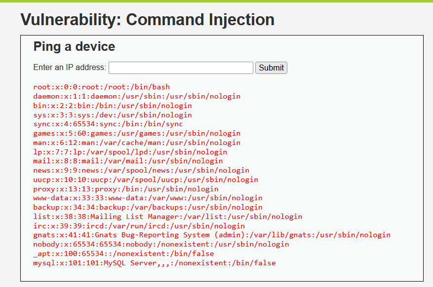

# Vulnerabilidad 3: Inyección de Comandos

## Evidencia y Payload
Comandos del sistema operativo concatenados a una IP válida:
`127.0.0.1; cat /etc/passwd`

## Por qué funciona
La aplicación pasa la entrada directamente a la terminal del sistema sin filtros. El carácter `;` actúa como separador ejecutando el segundo comando.

## CVSS y Prevención
* **Puntaje CVSS 3.1:** 9.8 (Crítico)
* **Defensa:** Emplear listas blancas estrictas y utilizar APIs seguras nativas del lenguaje en lugar de invocar la terminal del sistema operativo.